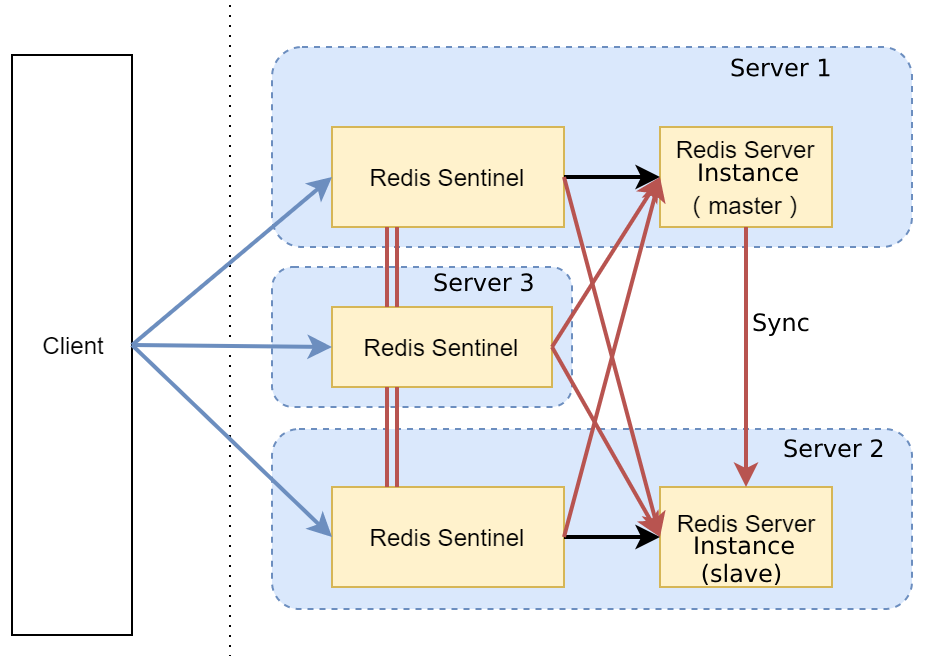

# Problems

Redis Sentinel is a high-availability master-slave solution given by Redis. Using it, we can deploy a fault-tolerant, highly available Redis cluster. The failover process is automated and requires no human intervention. For more information about Redis Sentinel refer to: <https://Redis.io/topics/sentinel>.

A typical sentinel architecture diagram is shown below:



It consists of three parts, the sentinel node, the data node and the client node:

- Sentinel node: The sentinel system consists of one or more sentinel nodes, which are special Redis nodes that do not store data.
- Data node: Both the master node and the slave node are data nodes.
- Client node: The Redis client fetchs the current master-slave node information through the sentinel protocol, and then connects the data nodes of the back-end to access the data.

In the architecture above we can see a problem, this solution is opaque to the client, the client needs to support the sentinel protocol to sense the master-slave information. 

Connecting an application to a Sentinel-managed Redis deployment is usually done with a Sentinel-aware Redis client. While most Redis clients do support Sentinel, the application needs to call a specialized connection management interface of the client to use it. When one wishes To migrate to a Sentinel-enabled Redis deployment, she/he must modify the application to use Sentinel-based connection management. Moreover, when the application uses a Redis client that does not provide support for Sentinel, the migration becomes that much more complex It also requires replacing the entire client library.

Some of the existing redis deployment solutions in the kubernetes community, such as [redis-ha](<https://github.com/helm/charts/tree/master/stable/redis-ha>), are basically similar to the above architecture, so the same problem exists.

# Solutions

In order to solve the above problem, we use Redis officially [sentinel_tunnel](<https://github.com/RedisLabs/sentinel_tunnel>) as Redis's smart proxy to shield the underlying Redis cluster status details and let the client connect the data node directly using the normal Redis protocol. the architecture diagram is as follows:

```
+-------------------------------------------+                                                           _,-'*'-,_
| +---------------------------------------+ |                                               _,-._      (_ o v # _)
| |                           +--------+  | |  +----------+       +----------+          _,-'  *  `-._  (_'-,_,-'_)
| |Application code           | Redis  |  | |  | Sentinel | +     |  Redis   | +       (_  O     #  _) (_'|,_,|'_)
| |(uses regular connections) | client +<------>+  Tunnel  +<----->+ Sentinel +<--+---->(_`-._ ^ _,-'_)   '-,_,-'
| |                           +--------+  | |  +----------+ | |   +----------+ | |     (_`|._`|'_,|'_)
| +---------------------------------------+ |    +----------+ |     +----------+ |     (_`|._`|'_,|'_)
| Application node                          |      +----------+       +----------+       `-._`|'_,-'
+-------------------------------------------+                                               `-'

```

# Installation


Deploy a transparent redis cluster in kubernetes becomes a simple job, just execute the `make` command:

```bash
cd redis-ha-operator
make
```

The [Makefile](<https://github.com/hackerthon2019/redis-ha/blob/master/redis-ha-operator/Makefile>) does the things below:

1. Build [sentinel_tunnel](<https://github.com/RedisLabs/sentinel_tunnel>)'s docker image
2. Deploy redis-ha's Custom Resource Definitions into kubernetes cluster
3. Build redis-ha-operator's docker image, Deploy redis-ha-operator into kubernetes cluster
4. Deploy demo redis-ha Custom Resource into kubernetes cluster

We also write a demo application using the redis-ha above, run the demo application refer to [here](https://github.com/hackerthon2019/redis-ha/tree/master/redis-ha-demo)

# How We Implements

1. Encapsulate [sentinel_tunnel](<https://github.com/RedisLabs/sentinel_tunnel>) as a [docker image](<https://github.com/hackerthon2019/redis-ha/tree/master/redis-ha -operator/helm-charts/redis-ha-st/docker/redis-st>), and [provide helm chart](<https://github.com/hackerthon2019/redis-ha/tree/master/redis-ha -operator/helm-charts/redis-ha-st/charts/redis-st>) to install it quickly.
2. Organize [redis-ha](<https://github.com/helm/charts/tree/master/stable/redis-ha>) and [above helm chart](<https://github.com/hackerthon2019 /redis-ha/tree/master/redis-ha-operator/helm-charts/redis-ha-st/charts/redis-st>), eventually forming a [big chart](<https://github.com/Hackerthon2019/redis-ha/tree/master/redis-ha-operator/helm-charts/redis-ha-st>) to quickly deploy the above architecture in kubernetes.
3. Refer to [operator-sdk's helm example](<https://github.com/operator-framework/operator-sdk/blob/master/doc/helm/user-guide.md>) to apply the above solution The chart is encapsulated into an operator, and the user only needs to create the custom resource according to the specification, so that the client transparent, high-availability redis cluster can be quickly deployed in the kubernetes cluster.
4. We write a [simple application](<https://github.com/hackerthon2019/redis-ha/tree/master/redis-ha-demo>) to verify the problem be solved by this architecture.

# TODO

1. Support [Redis Sharding Cluster](<https://redis.io/topics/cluster-spec>)

# Refenrence

1. <https://github.com/RedisLabs/sentinel_tunnel>
2. <https://helm.sh/>
3. <https://github.com/helm/charts/tree/master/stable/redis-ha>
4. <https://redis.io/topics/sentinel>
5. <https://github.com/operator-framework/operator-sdk/blob/master/doc/helm/user-guide.md>
6. <https://github.com/gin-gonic/gin>
7. <https://github.com/spf13/viper>
8. <https://vuejs.org/>
9. <https://element.eleme.io/>
10. <https://github.com/axios/axios>