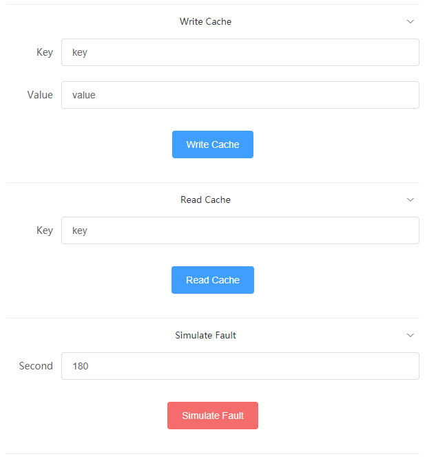

# Code Organization

1. `app`: router and biz
2. `client`: redis handler
3. `cmd`: main.go
4. `static`:  static file

# Usage

## Config Redis

Edit config.yaml

## Launch Demo

```
// set up GOPATH
cd hackerthon2019/redis-ha-demo
go run cmd/thon/main.go
```

## Test

1. Launch your browser and access `http://{your ip}:{your prot}/`, and will see the page like below:

2. Input a pair of key-value and click `Write Cache`, data will be written into redis.
3. Input the specific key and click `Read Cache`, then you will see the value.
4. Input the down time duration by second and click `Simulate Fault`, then one of the redis cluster may sleep.
5. Click `Read Cache` or `Write Cach`, you will still get the result from the redis cluster when a node is down.
